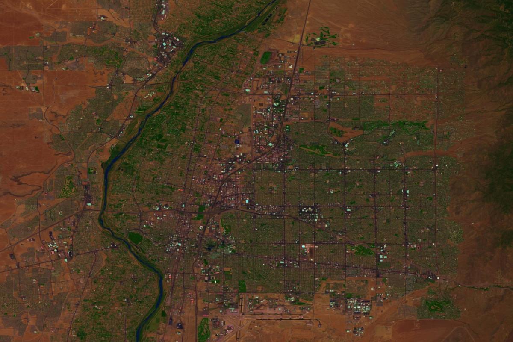

# landsat_fetch

A Python-based utility for automated acquisition and processing of Landsat 8 data



## Overview

`landsat_fetch` finds the latest Landsat products covering the requested geographic region (specified as a bounding box in latitude-longitude space),
optionally radiometrically corrects them (producing output in reflectance rather than DN), and mosaics them together to produce an output.

## Usage

Where `lat0` and `lon0` specify the northwest corner of the output product, and `lon1` and `lat1` represent the southwest corner, usage is simply:

```
landsat_fetch output.tiff lat0 lon0 lat1 lon1
```

By default, bands 4, 3, 2 are fetched (corresponding to RGB). This can be overridden by specifying the `-b` option one or more times, for example, to use the SWIR, NIR, and aerosol bands:

```
landsat_fetch output.tiff lat0 lon0 lat1 lon1 -b 7 -b 5 -b 1
```

Optionally, the `--calibrate` option can be added to retrieve the MTL metadata file for each fetched product and use it to convert the output to reflectance. By default, uncalibrated DN is used instead.

Pansharpening is also supported via the `--pansharpen` flag. Adding this flag will automatically fetch band 8 in addition to the other bands selected.

Currently, GeoTIFF is the only supported output format. Output is created in the equirectangular (WGS84) projection.
