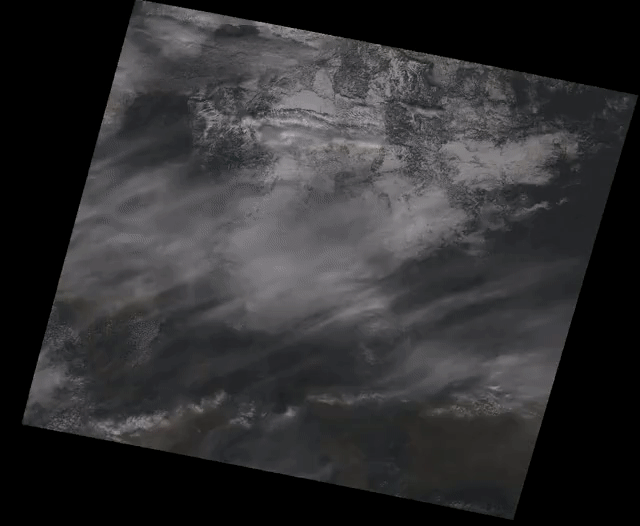

# landsat_fetch

A Python-based utility for automated acquisition and processing of Landsat 8 data


## Overview

`landsat_fetch` implements acquisition of Landsat 8 products and a couple of processing workflows.

## Installation

It is recommended to install in a virtual environment:

```sh
$ python3 -mvenv --system-site-packages venv
$ source venv/bin/activate
$ pip install -U pip setuptools
$ pip install .
```

## Mosaic

```
landsat_fetch mosaic
```

The `mosaic` workflow finds the latest Landsat products covering the requested geographic region (specified as a bounding box in latitude-longitude space),
optionally radiometrically corrects them (producing output in reflectance rather than DN), and mosaics them together to produce an output.

Where `lat0` and `lon0` specify the northwest corner of the output product, and `lon1` and `lat1` represent the southwest corner, usage is simply:

```
landsat_fetch mosaic output.tiff lat0 lon0 lat1 lon1
```

By default, bands 4, 3, 2 are fetched (corresponding to RGB). This can be overridden by specifying the `-b` option one or more times, for example, to use the SWIR, NIR, and aerosol bands:

```
landsat_fetch mosaic output.tiff lat0 lon0 lat1 lon1 -b 7 -b 5 -b 1
```

Optionally, the `--calibrate` option can be added to retrieve the MTL metadata file for each fetched product and use it to convert the output to reflectance. By default, uncalibrated DN is used instead.

Pansharpening is also supported via the `--pansharpen` flag. Adding this flag will automatically fetch band 8 in addition to the other bands selected.

Currently, GeoTIFF is the only supported output format. Output is created in the equirectangular (WGS84) projection.

## Timelapse



```
landsat_fetch timelapse
```

The `timelapse` workflow produces a video representation of changes to a particular scene over time.

Where `path` and `row` are the WRS coordinates of the target region, `start_date` is an ISO datetime string 
corresponding to the start of the timelapse, and `end_date` is an ISO datetime string corresponding to the end
of the timelapse, usage is:

```
landsat_fetch timelapse output.mp4 path row start_date end_date
```

The frame rate for the input scenes can be specified using the `-r rate` flag. Output will be stretched to
30 fps. The resolution of the output can be specified with the `-w width` flag.

By default, bands 4, 3, 2 are fetched (corresponding to RGB). This can be overridden by specifying the `-b`
option one or more times. As with the `mosaic` workflow, `--calibrate` can be added to convert from DN to
reflectance.

Variations in footprint between Landsat products is compensated for by reprojecting to ans equirectangular
space representing the union of all fetched products.

Currently, only mp4 output is supported.
